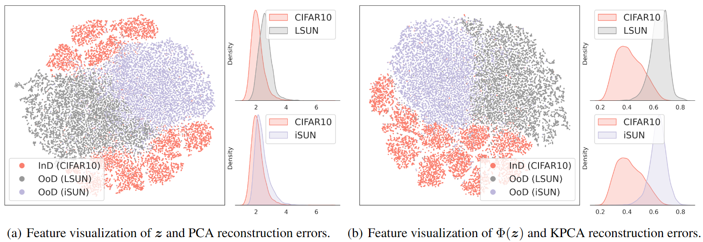

# Kernel PCA for Out-of-Distribution Detection
This is the official PyTorch implementation of the NeurIPS'24 paper [*Kernel PCA for Out-of-Distribution Detection*](https://proceedings.neurips.cc/paper_files/paper/2024/hash/f2543511e5f4d4764857f9ad833a977d-Abstract-Conference.html).

If our work benefits your researches, welcome to cite our paper!
```
@inproceedings{fang2024kpcaood,
author = {Fang, Kun and Tao, Qinghua and Lv, Kexin and He, Mingzhen and Huang, Xiaolin and YANG, JIE},
booktitle = {Advances in Neural Information Processing Systems},
editor = {A. Globerson and L. Mackey and D. Belgrave and A. Fan and U. Paquet and J. Tomczak and C. Zhang},
pages = {134317--134344},
publisher = {Curran Associates, Inc.},
title = {Kernel PCA for Out-of-Distribution Detection},
url = {https://proceedings.neurips.cc/paper_files/paper/2024/file/f2543511e5f4d4764857f9ad833a977d-Paper-Conference.pdf},
volume = {37},
year = {2024}
}
```

```
@misc{fang2025kpcaood,
title = {Kernel PCA for Out-of-Distribution Detection: Non-Linear Kernel Selections and Approximations}, 
author = {Kun Fang and Qinghua Tao and Mingzhen He and Kexin Lv and Runze Yang and Haibo Hu and Xiaolin Huang and Jie Yang and Longbin Cao},
year = {2025},
eprint = {2505.15284},
archivePrefix = {arXiv},
primaryClass = {cs.LG},
url = {https://arxiv.org/abs/2505.15284}, 
}
```
## NEWS
*2025-05* Glad to recommend our extended work: *Kernel PCA for Out-of-Distribution Detection: Non-Linear Kernel Selections and Approximations* ([arxiv](https://arxiv.org/abs/2505.15284), [code](https://github.com/fanghenshaometeor/ood-kpca-extension)), which provides a comprehensive framework on KPCA for OoD detection beyond prior explorations.


## KPCA for OoD detection in a nutshell

PCA-based reconstruction errors on the penultimate features of neural networks have been proved ineffective in OoD detection by existing works.
Accordingly, Kernel PCA is introduced in this study to explore nonlinear patterns in penultimate features for better OoD detection.
To be specific, we deliberately select 2 kernels and the associated feature mappings, and execute PCA in the mapped feature space to yield reconstruction errors as detection scores:
- A cosine kernel $k_{\rm cos}(\boldsymbol{z}\_1,\boldsymbol{z}\_2)=\frac{\boldsymbol{z}\_1^\top\boldsymbol{z}\_2}{\left\Vert\boldsymbol{z}\_1\right\Vert_2\cdot\left\Vert\boldsymbol{z}\_2\right\Vert_2}$ and its feature mapping $\Phi(\boldsymbol{z})\triangleq\phi_{\rm cos}(\boldsymbol{z})=\frac{\boldsymbol{z}}{\left\Vert\boldsymbol{z}\right\Vert_2}$.
- A cosine-Gaussian kernel and its feature mapping $\Phi(\boldsymbol{z})\triangleq\phi_{\rm RFF}(\phi_{\rm cos}(\boldsymbol{z}))$. $\phi_{\rm RFF}$ is the Random Fourier Features mapping w.r.t. the Gaussian kernel.

The following figure shows that the proposed feature mapping $\Phi$ significantly alleviates the non-linearity in the primal $\boldsymbol{z}$-space between InD and OoD data, leading to the much more distinguishable KPCA-based reconstruction errors than PCA-based ones.

<a href="pics/intro.png"><div align="center"></div></a>


## Pre-requisite
Prepare in-distribution and out-distribution data sets following the instructions in the [KNN repo](https://github.com/deeplearning-wisc/knn-ood).
Then, modify the data paths in `utils_ood.py` as yours.

Only for experiments on CIFAR10 and ImageNet of supervised contrastive learning, download the model checkpoints released by the [KNN repo](https://github.com/deeplearning-wisc/knn-ood) and put them as
```
ood-kernel-pca
├── model
├── save
|   ├── CIFAR10
|   |   └── R18
|   |       ├── ce
|   |       |   └── checkpoint_100.pth.tar
|   |       └── supcon
|   |           └── checkpoint_500.pth.tar
|   └── ImageNet
|       └── R50
|           └── supcon
|               └── supcon.pth
├── ...
```

## Running
step.1. Run the `feat_extract.sh` to extract the penultimate features.

step.2. 
- Run the `run_detection.sh` to obtain the detection results where only the KPCA-based reconstruction error serves as the detection score. 
- Run the `run_detection_fusion.sh` to obtain the detection results where the KPCA-based reconstruction error is fused with other detection scores (MSP, Energy, ReAct, BATS).

## 

If u have problems about the code or paper, u could contact me (fanghenshao@sjtu.edu.cn) or raise issues here.

If the code benefits ur researches, welcome to fork and star ⭐ this repo! :)
